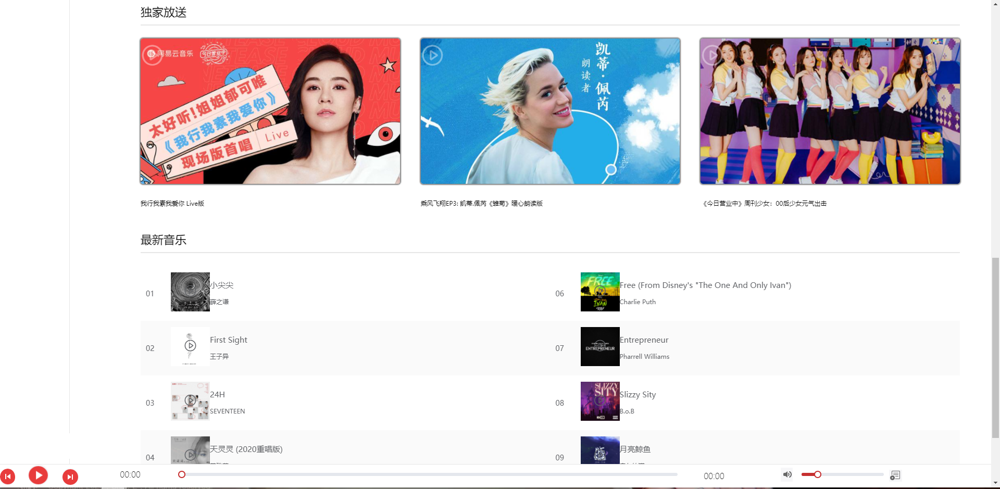

# vue_wzz_cloudMusic

**本人马上是在读大四学生! 所以可能项目经验没那么足,希望有漏洞差错,望谅解!!**

**第一次使用vue脚手架开发练手的一个项目,希望大家多多谅解!** 

**此项目也很适合大家去尝试编写! 从中可以学习到很多东西!** 

**肝代码不易, 最后希望帮忙点个star支持一哈!!**

==更多预览详情请看B站,预览效果视频会上传B站==


# **话不多说,上预览**


## 


## 歌单


## 排行榜


## 歌手


## 最新音乐


## 音乐云盘


## 歌单详情页


## 播放页


## 搜索页


```
npm install
```

### Compiles and hot-reloads for development
```
npm run serve
```

### Compiles and minifies for production
```
npm run build
```

### Customize configuration
See [Configuration Reference](https://cli.vuejs.org/config/).
